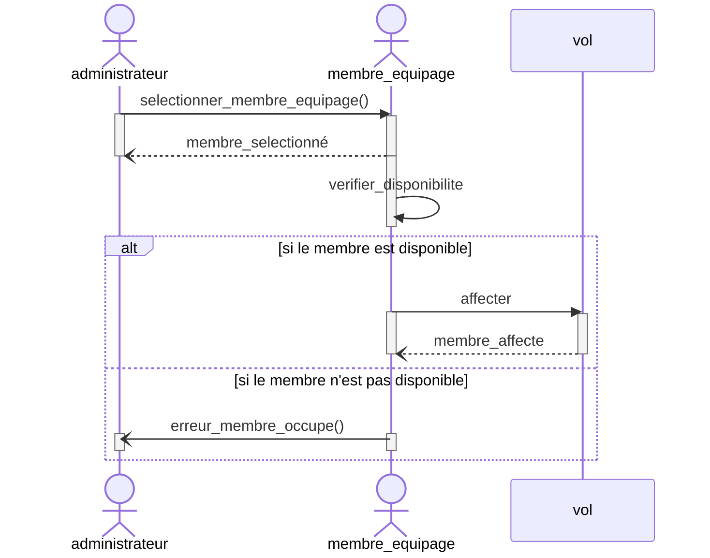

# Diagramme séquence affectation membre

```mermaid
sequenceDiagram
    actor administrateur
    actor membre_equipage
    participant vol
    administrateur->>membre_equipage:selectionner_membre_equipage()
    activate administrateur
    activate membre_equipage
    membre_equipage--)administrateur:membre_selectionné
    deactivate membre_equipage
    deactivate administrateur
    activate membre_equipage
    membre_equipage->>membre_equipage:verifier_disponibilite
    deactivate membre_equipage
    alt si le membre est disponible
        membre_equipage->>vol:affecter
        activate membre_equipage
        activate vol
        vol--)membre_equipage:membre_affecte
        deactivate vol
        deactivate membre_equipage
    else si le membre n'est pas disponible
        membre_equipage-)administrateur:erreur_membre_occupe()
        activate membre_equipage
        activate administrateur
        deactivate membre_equipage
        deactivate administrateur
    end
```