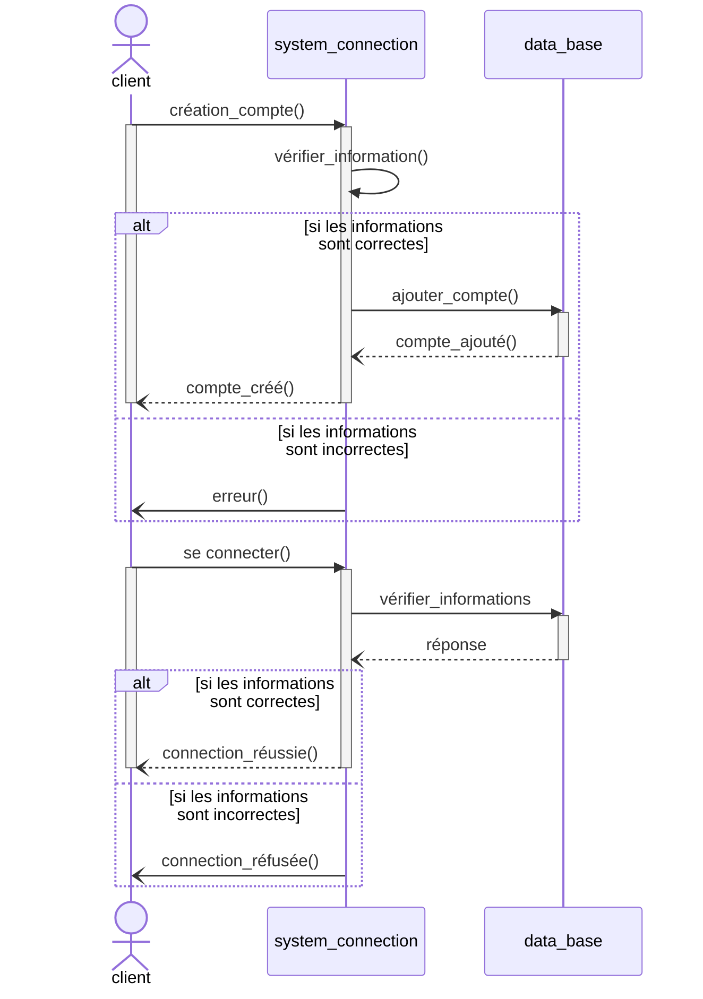

# Diagramme séquence authentification

```mermaid

sequenceDiagram
    actor client
    participant system_connection
    participant data_base
    client->>system_connection:création_compte()
    activate client
    activate system_connection
    system_connection->>system_connection:vérifier_information()
    alt si les informations sont correctes
        system_connection->>data_base:ajouter_compte()
        activate data_base
        data_base--)system_connection:compte_ajouté()
        deactivate data_base
        system_connection--)client:compte_créé()
        deactivate system_connection
        deactivate client
    else si les informations sont incorrectes
        system_connection-)client:erreur()
    end
    client->>system_connection:se connecter()
    activate client
    activate system_connection
    system_connection->>data_base:vérifier_informations
    activate data_base
    data_base--)system_connection:réponse
    deactivate data_base
    alt si les informations sont correctes
        system_connection--)client:connection_réussie()
        deactivate system_connection
        deactivate client
    else si les informations sont incorrectes
        system_connection-)client:connection_réfusée()
    end


```