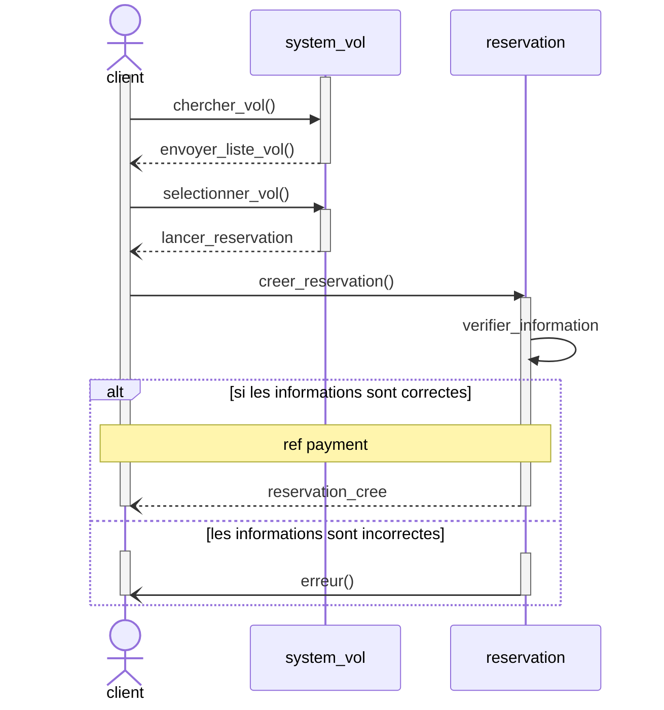

# Diagramme séquence

```mermaid
sequenceDiagram
    actor client
    participant system_vol
    participant reservation
    activate client
    activate system_vol
    client->>system_vol: chercher_vol()
    system_vol--)client: envoyer_liste_vol()
    deactivate system_vol
    client->>system_vol: selectionner_vol()
    activate system_vol
    system_vol--)client: lancer_reservation
    deactivate system_vol
    client->>reservation:creer_reservation()
    activate reservation
    reservation->>reservation:verifier_information
    alt si les informations sont correctes
        Note over client,reservation:ref payment
        reservation--)client:reservation_cree
        deactivate reservation
        deactivate client
    else les informations sont incorrectes
        activate client
        activate reservation
        reservation-)client:erreur()
        deactivate reservation
        deactivate client
    end
```